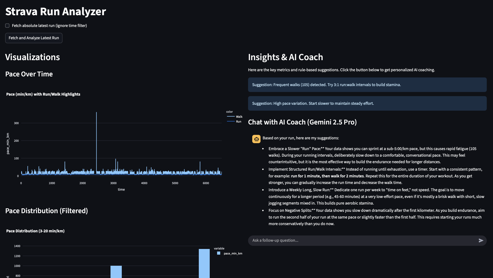

# Strava Run Analyzer

A Streamlit web app for analyzing Strava running activities with visualizations and AI-powered suggestions via Gemini.

## Features
- Fetch recent runs from your Strava account.
- Interactive visualizations: Pace over time, pace distribution, cumulative pace, run/walk timelines, and more.
- Rule-based insights to identify patterns in your runs.
- AI-powered suggestions from Google's Gemini model to provide personalized coaching.
- An interactive chat interface to ask follow-up questions about your performance.

## Setup and Configuration

Follow these steps to get the application running locally.

### Step 1: Set up your Strava API Application
1.  Go to the [Strava Developers](https://www.strava.com/settings/api) page and create a new application.
2.  You can name it whatever you like (e.g., "Local Run Analyzer").
3.  For the **Authorization Callback Domain**, enter `localhost`.
4.  Once the app is created, you will see your **Client ID** and **Client Secret**. Keep this page open.

### Step 2: Prepare Your Local Environment
1.  Clone the repository:
    ```bash
    git clone https://github.com/kikugo/strava-run-analyzer.git
    cd strava-run-analyzer
    ```
2.  Create a virtual environment and install the required packages:
    ```bash
    python -m venv venv
    source venv/bin/activate
    pip install -r requirements.txt
    ```
3.  Create your environment file. Copy the example file to a new `.env` file:
    ```bash
    cp .env.example .env
    ```
4.  Now, open the `.env` file and fill in the following keys:
    *   `CLIENT_ID`: From your Strava API page.
    *   `CLIENT_SECRET`: From your Strava API page.
    *   `GOOGLE_API_KEY`: Your API key from Google AI Studio.

### Step 3: Authorize with Strava
This is a one-time step to get your initial access tokens.
1.  Run the authentication script:
    ```bash
    python auth.py
    ```
2.  Your web browser will open to a Strava authorization page. Click **Authorize**.
3.  You will be redirected to a non-working `localhost` page. This is expected. Copy the `code` from the URL in your browser's address bar (it's the long string of characters after `&code=`).
4.  Paste this code back into your terminal and press Enter. The script will update your `.env` file with the initial `ACCESS_TOKEN` and `REFRESH_TOKEN`.

## Usage
You're all set! To run the application:
```bash
streamlit run src/app.py
```

## Screenshots


## License
MIT 